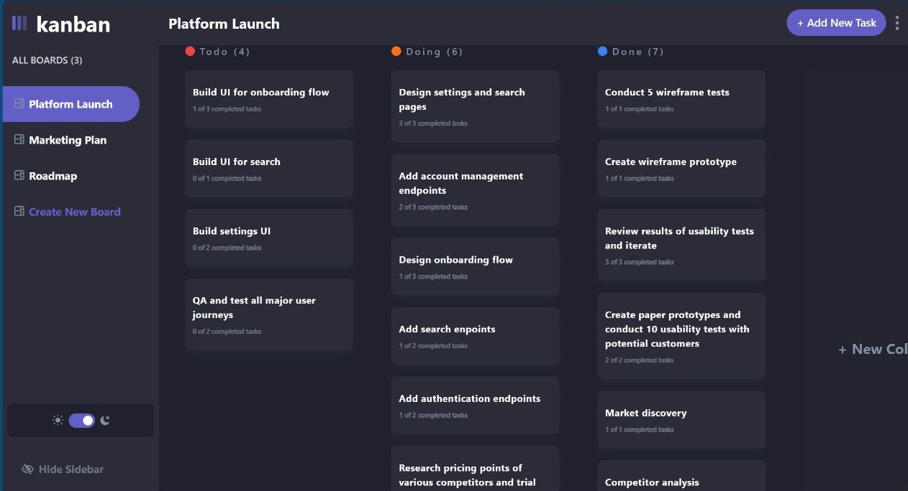

# Project Title: Kanban Board Task Management Application

# Project Overview:
The Kanban Board Task Management Application is a web-based task management platform inspired by popular tools like Trello. Its primary objective is to provide users with a seamless and visual way to manage their tasks across different stages of completion. The application is designed to enhance productivity by allowing users to organize and track their tasks efficiently.

## Table of contents

- [Overview](#overview)
  - [The challenge](#the-challenge)
  - [Screenshot](#screenshot)
  - [Links](#links)
  - [Built with](#built-with)
  - [Useful resources](#useful-resources)

## Overview

### The challenge

Users should be able to:

- View the optimal layout for the app depending on their device's screen size
- See hover states for all interactive elements on the page
- Create, read, update, and delete boards and tasks
- Receive form validations when trying to create/edit boards and tasks
- Mark subtasks as complete and move tasks between columns
- Hide/show the board sidebar

Expected Behaviour:

- Boards
  - Clicking different boards in the sidebar will change to the selected board.
  - Clicking "Create New Board" in the sidebar opens the "Add New Board" modal.
  - Clicking in the dropdown menu "Edit Board" opens up the "Edit Board" modal where details can be changed.
  - Columns are added and removed for the Add/Edit Board modals.
  - Deleting a board deletes all columns and tasks and requires confirmation.
- Columns
  - A board needs at least one column before tasks can be added. If no columns exist, the "Add New Task" button in the header is disabled.
  - Clicking "Add New Column" opens the "Edit Board" modal where columns are added.
- Tasks
  - Adding a new task adds it to the bottom of the relevant column.
  - Updating a task's status will move the task to the relevant column.

Bonus:

- The tasks can be dragged and dropped to a new column.

### Screenshot

#### Desktop

#### Responsive

### Links

- Live Site URL: [link](https://kanban-task-mangement-ruby.vercel.app/)

### Built with

- [TailwindCSS](https://tailwindcss.com/) - CSS Framework
- Drag and Drop API
- [React](https://reactjs.org/) - JS library
- [Redux](https://redux.js.org/) - State management tool

## Devloper Contact

- LinkedIn - [Suraj Kumar Sahoo](https://www.linkedin.com/in/suraj-kumar-sahoo-59a115171/)

- Mail Id - surajkumarsahoo729@gmail.com
